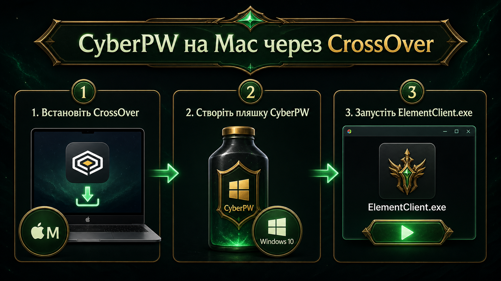
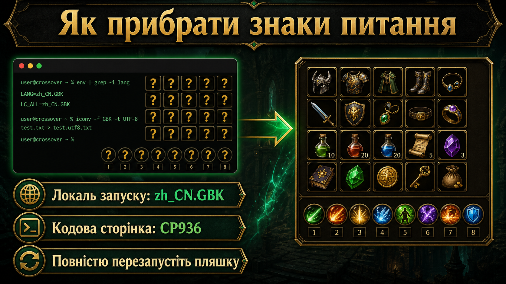
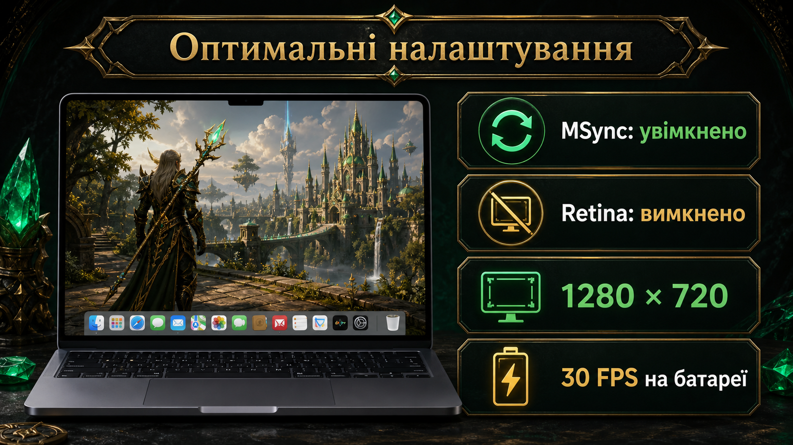

# CyberPW на Mac з Apple Silicon через CrossOver

> Перевірено на MacBook Air з Apple Silicon. CrossOver прибрав сильні лаги, а запуск із локаллю `zh_CN.GBK` виправив знаки питання замість іконок.

> [!NOTE]
> Це окремий гайд для запуску гри на macOS. Windows-інструменти CyberPW Assistant запускайте на Windows 7/10/11 або у сумісному Windows-середовищі.

**Швидкі посилання:** [CrossOver](https://www.codeweavers.com/crossover) · [CyberPW](https://cyberpw.fun/) · [CyberPW Assistant 0.90](https://github.com/vitalikjukivskiy/titul_helper/releases/tag/v0.90-design-preview) · [Титули онлайн](https://vitalikjukivskiy.github.io/titulPW/)


## Зміст

- [Що потрібно](#що-потрібно)
- [Встановлення Rosetta](#1-встановлення-rosetta)
- [Встановлення CrossOver](#2-встановлення-crossover)
- [Створення пляшки](#3-створення-пляшки)
- [Встановлення CyberPW](#4-встановлення-cyberpw)
- [Правильний запуск](#5-правильний-запуск)
- [Виправлення знаків питання](#6-виправлення-знаків-питання)
- [Налаштування продуктивності](#7-налаштування-продуктивності)
- [Типові проблеми](#8-типові-проблеми)

## Що потрібно

- Mac із процесором Apple Silicon: M1, M2, M3, M4 або новіший.
- Актуальна macOS і Rosetta.
- [CrossOver](https://www.codeweavers.com/crossover).
- 45–50 ГБ вільного місця.
- Повністю завантажений `CyberPWInstaller.zip`.

## 1. Встановлення Rosetta

Зазвичай macOS запропонує встановити Rosetta автоматично. За потреби виконайте:

```bash
softwareupdate --install-rosetta --agree-to-license
```

## 2. Встановлення CrossOver

1. Завантажте CrossOver з офіційного сайту.
2. Перенесіть `CrossOver.app` у `Applications`.
3. Відкрийте програму та надайте стандартні дозволи macOS.

> [!WARNING]
> Не вимикайте Gatekeeper або SIP заради запуску гри.

## 3. Створення пляшки

Створіть окрему 64-бітну пляшку:

| Параметр | Значення |
|---|---|
| Назва | `CyberPW` |
| Версія Windows | Windows 10 |
| MSync | Увімкнено |
| Retina / High Resolution | Вимкнено |

Не встановлюйте компоненти Wine навмання.

## 4. Встановлення CyberPW

Повністю розпакуйте `CyberPWInstaller.zip`. В одній папці мають лежати:

- `CyberPWInstaller.exe`;
- `CyberPWInstaller-1.bin` … `CyberPWInstaller-11.bin`.

Потім:

1. Відкрийте пляшку `CyberPW`.
2. Натисніть **Run Command**.
3. Виберіть `CyberPWInstaller.exe`.
4. Залиште стандартний шлях:

   ```text
   C:\Program Files\CyberPW
   ```

5. Дочекайтеся завершення.
6. Запустіть лаунчер і дайте йому повністю оновити клієнт.

## 5. Правильний запуск

Після оновлення запускайте:

```text
C:\Program Files\CyberPW\ElementClient.exe
```

з аргументами:

```text
startbypatcher nocheck console:1
```

> [!IMPORTANT]
> Без цих аргументів `ElementClient.exe` може працювати неправильно.

## 6. Виправлення знаків питання

У ресурсах CyberPW є файли з китайськими назвами. Через неправильну локаль клієнт не знаходить текстури й показує жовті знаки питання.



Зміна реєстру пляшки на CP936 не допомагає: CrossOver після перезапуску повертає стандартні кодові сторінки. Перевірене рішення — запускати гру з локаллю `zh_CN.GBK`.

Спочатку повністю закрийте гру та всі процеси пляшки.

### Клієнт встановлено в CrossOver

```bash
GAME="$HOME/Library/Application Support/CrossOver/Bottles/CyberPW/drive_c/Program Files/CyberPW"
CXSTART="$HOME/Applications/CrossOver.app/Contents/SharedSupport/CrossOver/bin/cxstart"

env LANG=zh_CN.GBK LC_ALL=zh_CN.GBK \
"$CXSTART" --bottle CyberPW --workdir "$GAME" --no-wait \
"$GAME/ElementClient.exe" startbypatcher nocheck console:1
```

Якщо CrossOver встановлений у системній папці:

```bash
CXSTART="/Applications/CrossOver.app/Contents/SharedSupport/CrossOver/bin/cxstart"
```

### Клієнт залишився у пляшці Whisky

У змінній `GAME` вкажіть фактичний шлях:

```bash
GAME="$HOME/Library/Containers/com.franke.Whisky/Bottles/ID-ПЛЯШКИ/drive_c/Program Files/CyberPW"
```

Ключова частина команди:

```bash
env LANG=zh_CN.GBK LC_ALL=zh_CN.GBK
```

Саме вона повертає нормальні іконки предметів і навичок.

## 7. Налаштування продуктивності



- MSync — увімкнено.
- Retina / High Resolution Mode — вимкнено.
- Віконний режим: `1280×720` або `1440×900`.
- Мінімальні тіні, ефекти та дальність промальовування.
- На батареї — обмеження 30 FPS і Low Power Mode.
- Не запускайте Whisky та CrossOver одночасно.

## 8. Типові проблеми

### Гра не відкривається

- Переконайтеся, що лаунчер завершив оновлення.
- Використовуйте аргументи `startbypatcher nocheck console:1`.
- Повністю зупиніть процеси пляшки та повторіть запуск.

### Іконки знову стали знаками питання

- Запускайте гру через Terminal із `LANG` і `LC_ALL`.
- Звичайний ярлик CrossOver без цих змінних знову ламає назви ресурсів.
- Завершіть усі старі процеси пляшки.

### Сильні лаги

- Вимкніть Retina.
- Використовуйте `1280×720` у віконному режимі.
- Залиште MSync увімкненим.

### Кольори або текстури спотворені

- Спочатку перевірте запуск із `zh_CN.GBK`.
- Тестуйте графічні режими по одному.
- Після кожної зміни повністю перезапускайте пляшку.
- Спочатку перевірте стандартний режим CrossOver, потім окремо DXVK.

## Примітка

Це неофіційний гайд. Після оновлень CyberPW, CrossOver або macOS спосіб запуску може змінитися.

Для діагностики вказуйте модель Mac, версію macOS, версію CrossOver, графічний режим і додавайте скриншот помилки.

## Корисні посилання

- [Сайт CyberPW](https://cyberpw.fun/)
- [Форум CyberPW](https://forum.cyberpw.fun/)
- [CyberPW Assistant 0.90 Design Preview](https://github.com/vitalikjukivskiy/titul_helper/releases/tag/v0.90-design-preview)
- [Онлайн-довідник титулів](https://vitalikjukivskiy.github.io/titulPW/)
- [Повідомити про проблему з цим гайдом](https://github.com/vitalikjukivskiy/cyberpw-mac-crossover-guide/issues)
